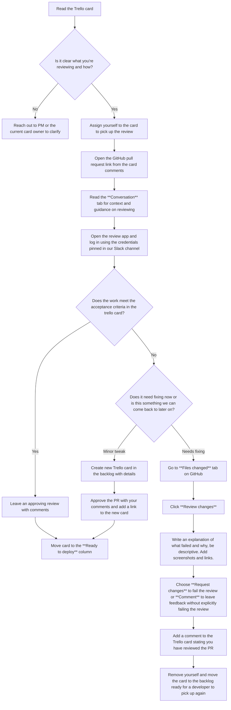

# Review Guide

How we review our work

## Table of Contents

 1. [Overview](#overview)
 2. [Preparing your work for review](#preparing-your-work-for-review)
 3. [Reviewing someones work on Github](#reviewing-someones-work-on-github)
 4. [Review tips](#review-tips)

## Overview

We use Github to manage changes to our code and Trello to project manage our workload.

Everything we do _should_ go through a strict review process to maintain a high standard and make sure we're not putting anything broken into production. This means it needs a fresh set of eyes on it that isn't the person who did the work.

This can look slightly different depending on what's being reviewed. Below is some general guidance on how to open your work for review, request a review, and how to review someone elses work.

## Preparing your work for review

1. Once you have completed the work against a ticket, open a pull request and fill out the template provided detailing the trello card, context, changes and any guidance for reviewers on how to test the work.
2. Add a comment on the trello card with a link to your PR. You can (optionally) assign the ticket to someone in particular that you would like to review.
3. Move your trello card to the `Review` column
4. Let the team know in the Slack channel or mention it at standup that there is something that needs reviewing

## Reviewing someones work on Github

1. Start with the trello card for the work. Each card should represent a singular small to medium sized chunk of work. Read the card thoroughly to understand the feature, the acceptance criteria, who is involved, and any historic decisions taken documented in the comments or links attached to the ticket.
2. Is it clear on what you’re reviewing and how?
    1. Yes - Go to 3
    2. No - Reach out to the PM or the creator of the ticket to clarify
3. Assign yourself to the ticket to declare your intention to review it
4. Open the link to the Github pull request from the card (this should be in the comments of the card)
5. Read through the `Conversation` tab of the PR for extra context. Each PR uses a standard template which details the trello card, context, changes, and any guidance for testing.
6. Open the review app (this will be commented in the `Conversation` tab of the PR automatically during the deploy process) and log in with the credentials found pinned in our Slack channel.
7. Does the work done meet all the acceptance criteria? Don’t forget to check on mobile too!
    1. Yes
        1. Leave an approving review with any comments
        2. Go to 8
    2. No
        1. Is this something the needs fixing now, or a minor tweak that doesn’t prevent us from deploying and that we can fix in a new ticket?
            1. This doesn't meet the acceptance criteria and needs fixing before we can merge and deploy it
                1. Go to the `Files changed` tab of the pull request on Github
                2. Click the `Review changes` button.
                3. Write an explanation of why this did not meet the acceptance criteria. Include screenshots and links where possible, be descriptive.
                4. Check `Request changes` if there is work to be done to fix this, or `Comment` to add clarification, notes, or questions without explicitly failing the review
                5. Add a comment to the trello card to say you have reviewed it
                6. Remove yourself from the card and place it back in the backlog for a developer to pick up and make changes
            2. It’s a minor tweak that doesn’t break functionality and we can fix it later
                1. Create a new trello card in the backlog. Be as descriptive as possible and include screenshots
                2. Approve the PR with your comments and link the new trello card
                3. Go to 8
8. Move the trello card to the `Ready to deploy` column

## Review tips

- Make sure it works on mobile as well as desktop (it doesn't have to be perfect, but it should not look obviously broken)
- Raise new tickets for anything that needs doing but that isn't part of the ticket you're reviewing
